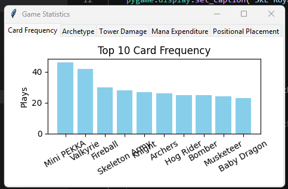
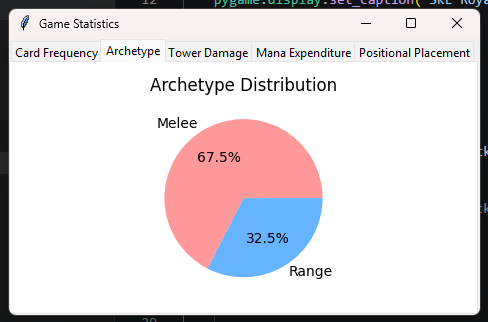
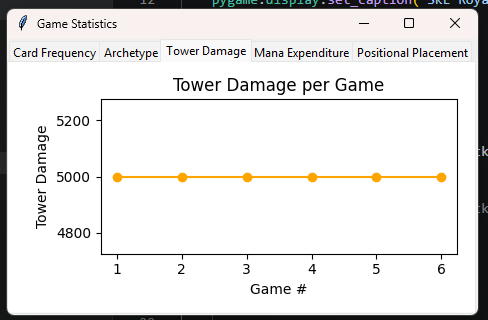
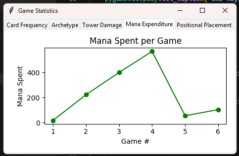
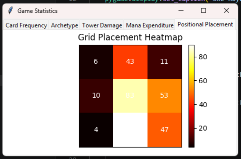

# VISUALIZATION.md

## Data Visualizations — SKE Royale Statistics Window

The statistics window is opened from the main menu by clicking the **STATS** button. It reads `game_stats.csv` and presents five interactive charts across five tabs, each derived from data logged during gameplay. The sections below describe each visualization and the data behind it.

---

### 1. Card Frequency (Bar Chart)

**Tab:** Card Frequency

The Card Frequency bar chart displays the top 10 most-played cards across all recorded sessions, sorted in descending order by play count. Each bar represents a single card name on the horizontal axis, and its height reflects the total number of times that card was deployed. This visualization is derived from all rows in `game_stats.csv` where `event = card_played`, grouped by the `card_name` column. A taller bar for a particular card reveals a strong preference or reliance on that unit, indicating it is central to the player's strategy. Conversely, cards with short bars are rarely used and may not fit the player's preferred deck composition.

---

### 2. Archetype Distribution (Pie Chart)

**Tab:** Archetype

The Archetype Distribution pie chart breaks all card plays into two categories — **Melee** and **Range** (which includes summon-type units such as the Witch). The percentage split is calculated from the `attack_type` column of every `card_played` row in the CSV: values of `melee` are counted as Melee; values of `range` or `summon` are counted as Range. This chart reveals the player's overall strategic tendency — a dominant melee slice suggests an aggressive, frontline-heavy playstyle, while a larger ranged slice indicates a preference for stand-off or support-based units that can attack from a distance without directly engaging enemies.

---

### 3. Tower Damage per Game (Line Graph)

**Tab:** Tower Damage

The Tower Damage per Game line graph plots the cumulative damage the player's tower received in each individual game session along the vertical axis, with game number on the horizontal axis. Each data point is the sum of the `damage` column from all `tower_damage` rows that occurred before the corresponding `game_over` row in the CSV. A rising trend across games indicates that the player is surviving into later, harder waves (where enemies deal more damage per hit due to wave scaling), even if the tower ultimately falls. A flat or declining trend may indicate the player is being eliminated earlier, before tougher enemies arrive.

---

### 4. Mana Expenditure per Game (Line Graph)

**Tab:** Mana Expenditure

The Mana Expenditure per Game line graph plots the total mana spent across each game session. It is computed by summing the `mana_cost` column for all `card_played` rows belonging to each game (delimited by `game_over` rows). Higher mana expenditure in a given session directly correlates with more cards played, which in turn reflects a longer survival time — since the player must keep deploying units to hold back increasingly stronger waves. A sharp increase in mana spent over successive games suggests the player is improving their deck efficiency and surviving longer, while a flat line may indicate consistent but brief runs.

---

### 5. Positional Placement (Heatmap)

**Tab:** Positional Placement

The Positional Placement heatmap renders the player's 3×3 deployment grid (sections 0–8, where the player places cards during battle) as a colour-coded grid. Each cell's colour intensity and overlaid number represents how many times the player deployed a card into that particular grid section across all recorded sessions. Brighter or hotter colours indicate heavily favoured positions. This data is sourced from the `grid_section` column of every `card_played` row in the CSV. Patterns in the heatmap expose positional habits — for example, clustering in the bottom-center cell may indicate a preference for deploying cards directly in front of the tower, while heavy usage of corner sections might suggest a flanking strategy.